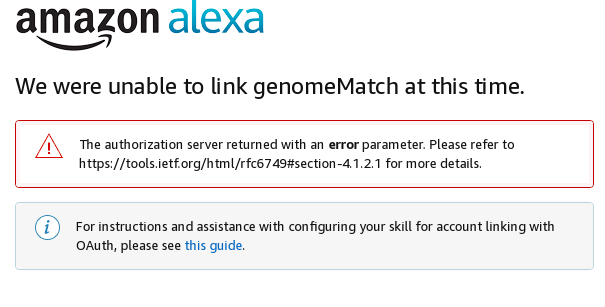

# alexa-genome_match

This is code I created for the [Genome Link competition](https://genomelink.devpost.com/). The program is an **Alexa skill** that is supposed to go to [Genome Link](https://genomelink.io/) to access genome data for different users.  It gather reports on all the personality traits and stores them in a **Amazon DynamoDB** along with a name supplied by the user.  The user can then select pairs of saved genome reports to compare, looking for matches in high or low levels of traits.

I built it as an opportunity to create an Amazon Alexa skill in **Python**, as all my previous skills were written in Javascript or Java which are supported by Amazon with their [Alexa Skills Kit SDK for Node.js ](https://github.com/alexa/alexa-skills-kit-sdk-for-nodejs) and [alexa-skills-kit-sdk-for-java](https://github.com/alexa/alexa-skills-kit-sdk-for-java), respectively. 

At this point, I still can't get **`OAuth`** to work between the Amazon Alexa app and the Genome Link servers.  Adam Jones (@domdomegg) succeeded with this in his [project](https://devpost.com/software/genome-link-aws-lambda-demo-alexa-skill), but following the instructions on [his Github](https://github.com/domdomegg/genomelink-aws-lambda-demo/blob/master/README.md) didn't work for me.  When I click `Link Account` in the Alexa app, it sends me an error page 

Updates and more background on this project are available on [Devpost](https://devpost.com/software/genome-match/)
